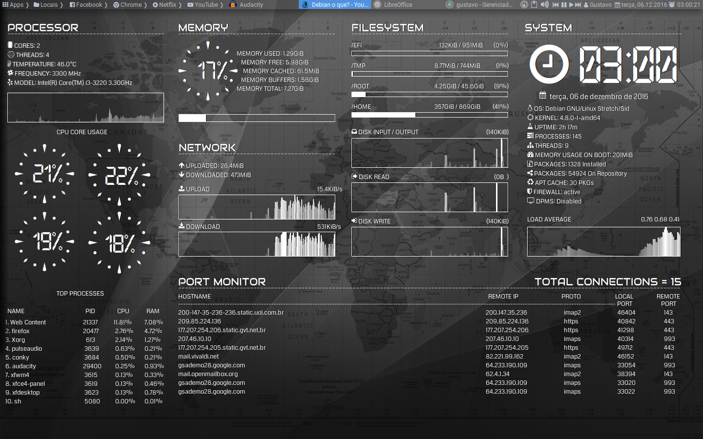
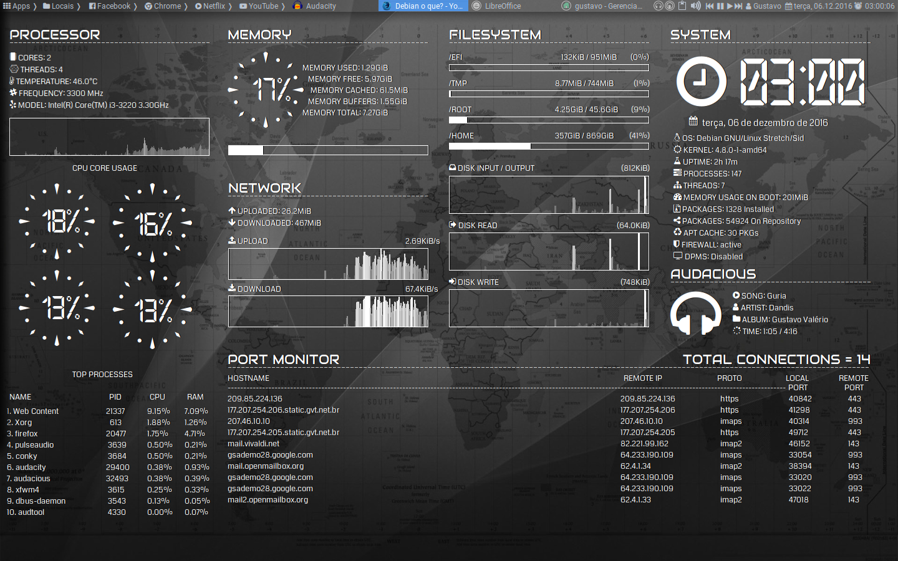

##**Conky for Debian Gnu/Linux and derivatives**
===

By Gustavo Valério
 www.gustavovalerio.com

***VERSION 2 RELEASED!***

*Changelog:*

1. Commands improved.
2. Blocks reorganized.
3. Added block exclusive for "*Port Monitor*".
4. Added repository package counter
5. Removed "TOP RAM PROCESSES" because it showed inconsistent information
6. Added column "RAM" to "TOP CPU PROCESSES".
7. Added graphic load average while *Audacious* not running.
8. Added compatibility for resolution 1360x768

***LICENSE GPL V 2.1***
 *Free for use and modification*
 *Keep the credits*

**DEPENDENCIES**

1. Font Coda [DOWNLOAD](Fonts/Coda/Coda.ttf)
2. Font Awesome [DOWNLOAD](Fonts/Awesome/FontAwesome.otf)
3. Font Audiowide [DOWNLOAD](Fonts/Audiowide/Audiowide.ttf)
4. Font Open 24 Display St [DOWNLOAD](Fonts/Open 24 display/Open24DisplaySt.ttf)
5. Font ConkyWind [DOWNLOAD](Fonts/ConkyWind/ConkyWind.otf)
6. Package conky-all (`apt install conky-all`)
7. Package lm-sensors (`apt install lm-sensors`)

**INSTALLATION**

1. Install packages **conky-all** and **lm-sensors** (`apt install conky-all lm-sensors`). 
2. Execute **sensors-detect** on root terminal and press ENTER until finished.
3. Choose the file according to your resolution.
4. Rename the file for *.conkyrc* and move for your user folder on */home*.

   **PREVIEW CONKY FULL GVS V2 - 1440X900**
 

   **PREVIEW CONKY FULL GVS V2 AUDACIOUS RUNNING- 1440X900**
 

   **PREVIEW CONKY FULL GVS V1 - 1440X900**
 
